# Project Palantír: Orbital Telemetry Digital Twin 🛰️👁️

> *"They were not made by Sauron... They were made by the Noldor in Eldamar... to see far off, and to converse in thought with one another."* — Gandalf on the Palantíri

## 🚀 About The Project

Project Palantír is a Proof of Concept (PoC) constructing a "Digital Twin" ground segment environment.

It bridges the gap between high-fidelity astrodynamics simulation and operational mission control software. The goal is to demonstrate the integration of complex Java-based physics engines with standardized telemetry protocols used in the space industry.

This system simulates a satellite in Low Earth Orbit (similar to the ISS) and streams its real-time position, velocity, and simulated sensor data to a local mission control instance.

## 🏗️ Architecture (The Eye & The Tower)

The system is composed of two main pillars operating in tandem:

- **The Physics Engine (The Seeing Stone):** A Spring Boot 3.2+ application leveraging the Orekit library. It calculates the precise Keplerian orbit, propagates the state vector in real-time using Java 21 Virtual Threads, and generates synthetic telemetry.

- **Mission Control (The Tower):** A Yamcs instance running in a Docker container. It acts as the ground station, receiving, archiving, and visualizing the incoming telemetry stream via its REST API.

### Data Flow

```mermaid
graph LR
    A["🛰️ Java 21 App\n(Orekit)"]
    B["📡 Yamcs Server\n(Docker)"]
    C["🖥️ Mission Control UI\n(Browser)"]

    A -- "JSON / REST" --> B -- "WebSocket" --> C

    style A fill:#2d333b,stroke:#58a6ff,color:#c9d1d9
    style B fill:#2d333b,stroke:#3fb950,color:#c9d1d9
    style C fill:#2d333b,stroke:#d29922,color:#c9d1d9
```



## 🛠️ Tech Stack

| Technology | Purpose |
|---|---|
| **Java 21** (LTS) | Core language, utilizing Virtual Threads (Project Loom) for high-throughput telemetry processing |
| **Spring Boot 3.x** | Application framework and scheduling |
| **Orekit 12.0** | Astrodynamics and operational space flight dynamics library |
| **Yamcs** | Mission control system for spacecraft telemetry & commanding |
| **Docker** | Containerization of the Yamcs server |
| **Maven** | Dependency management |

## ⚡ Getting Started

### Prerequisites

- Java 21 SDK
- Docker & Docker Compose
- Maven

### Installation & Setup

#### 1. Start Mission Control (Yamcs)

Spin up the Yamcs server using the official quickstart Docker image. It will listen on port 8090.

```bash
docker run --rm --name yamcs -p 8090:8090 yamcs/yamcs:latest
```

Verify by visiting http://localhost:8090 in your browser.

#### 2. Configure Physics Data (Crucial Step!)

Orekit requires physical data (leap seconds, Earth orientation parameters, gravity models) to function.

1. Download the data archive: `orekit-data-master.zip`
2. Place the `orekit-data-master.zip` file into the `src/main/resources/` directory of the Spring Boot project.

> The application is configured to auto-load data from this zip upon startup.

#### 3. Build and Run the Simulation Engine

Navigate to the project root and run:

```bash
mvn spring-boot:run
```

## 🖥️ Usage / Verification

Once both components are running:

1. Check the Spring Boot logs. You should see periodic messages indicating telemetry packets are being sent (e.g., `[ScheduledTask] Sending telemetry for altitude: 408 km`).
2. Open the Yamcs Web Interface at http://localhost:8090.
3. Navigate to the **Telemetry** or **Parameters** view.
4. Observe the live data streaming in from your Java application, visualizing the orbital path of your simulated satellite.

## 🔭 Future Improvements

- [ ] Implementation of CCSDS packet standards instead of raw JSON.
- [ ] Adding bidirectional communication (Telecommanding) to alter the satellite's orbit.
- [ ] Deploying the Spring Boot application into a Kubernetes cluster alongside Yamcs.

## 🤖 Development Methodology
This project was built using an **AI-augmented workflow** (Claude Code / Copilot).
AI tools were leveraged for:
* Generating Orekit configuration boilerplate.
* Accelerating Java 21 record definitions.
* Writing initial Unit Tests.
* **Core logic and architecture were design-reviewed and integrated by the human author.**

## 👤 Author

**Jakub Tóth**
Senior Systems Engineer aiming for the stars.

[LinkedIn Profile Link] | [GitHub Profile Link]
