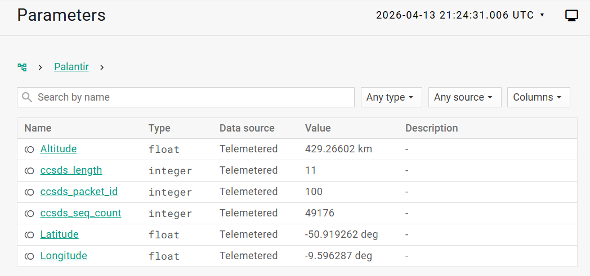
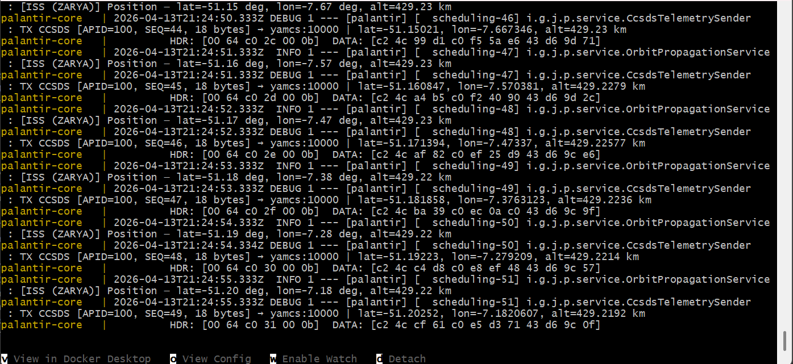

<!--
  Palantir — Spaceport_SK 2026 Application Deck
  
  8-slide application deck for the 5th cohort of the Spaceport_SK
  incubation programme, operated by the Slovak Space Office (SARIO)
  in cooperation with the Slovak Ministry of Education. Submitted by
  e-mail to spaceoffice@sario.sk together with project topic and team
  composition in the e-mail body. This deck stands alone as the project
  introduction and contains no team or topic metadata.
-->

# PALANTIR

**An open-source digital twin bridging astrodynamics and mission control.**

April 2026

<div style="page-break-before: always;"></div>

# Where this comes from

**12 years mission-critical Java systems engineering**
Telco SDN  ·  FinTech transactional systems

**Currently shipping:** distributed booking platform with protocol translation
and a spatial data normalisation engine  *(Coderama, 2022 – current)*

**MSc thesis** (UMB, 2017): C++/OpenMP implementation of a peer-reviewed heavy-ion event-classification method

---

*I stopped reading about space and started building.*

<div style="page-break-before: always;"></div>

# Why the ground segment

| TELCO SDN  *(where I ship)*                | SPACE GROUND SEGMENT                     |
|--------------------------------------------|------------------------------------------|
| **YANG**  (RFC 7950)                       | **XTCE**  (CCSDS 660.0-B-2)              |
| **NETCONF / RESTCONF**  (RFC 6241 / 8040)  | **CCSDS Space Packet**  (CCSDS 133.0-B-2)|
| **OpenDaylight**  (Apache Karaf)           | **Yamcs**  (OSGi-style services)         |
| Shipped to 99.999% Telco SLAs              | Mission-critical TM/TC loops             |

*Seven years of the left column made the right column look familiar.*

<div style="page-break-before: always;"></div>

# What it is

**Three pieces glued together. Fully open-source stack.**

```
   ┌──────────────────┐                       ┌──────────────────┐
   │  PALANTIR-CORE   │  CCSDS  /  UDP :10000 │ YAMCS (upstream) │
   │                  │ ────────────────────► │                  │
   │  Spring Boot 3   │   18-byte Space Pkt   │   Yamcs 5.12     │
   │  Java 21 / VT    │   APID 100, 1 Hz      │   UdpTmDataLink  │
   │                  │                       │                  │
   │  Orekit 12.2     │                       │   XTCE MDB       │
   │  SGP4 / SDP4     │      UDP :10001       │   Web UI :8090   │
   │  TEME→ITRF→WGS84 │ ◄──────────────────── │                  │
   │                  │   Telecommand opcode  │   UdpTcDataLink  │
   └──────────────────┘                       └──────────────────┘
             ▲                                          │
             │  POST /api/orbit/tle                     │  WebSocket
             │  (hot-swap TLE)                          ▼  live params
        ┌─────────┐                                ┌─────────┐
        │ OPERATOR│                                │ BROWSER │
        └─────────┘                                └─────────┘
```

<div style="page-break-before: always;"></div>

# Where it is today

**Not a slide deck. A working system you can run today.**

```
$ docker compose up --build
```

**Within a minute of a warm start:**

- Default ISS TLE loads automatically
- Yamcs Web UI on `http://localhost:8090`
- Three parameters streaming at 1 Hz: `/Palantir/Latitude`  ·  `/Palantir/Longitude`  ·  `/Palantir/Altitude`
- Persistent archive on Docker volume — survives restart

**Engineering quality:**

- JUnit 5 / Mockito / AssertJ — unit + Spring slice tests
- JaCoCo coverage report
- Javadoc on every main class
- 4 markdown docs in repo: README · ARCHITECTURE · FLOW · FEATURES

---

*Active development since February 2026  ·  MIT license*

<div style="page-break-before: always;"></div>

# What you'll see

|  |  |
|:---:|:---:|
| **Live parameters at 21:24:31 UTC** | **Raw CCSDS Space Packets, 1 Hz cadence** |

**Reading the header bytes**  ( `HDR:  00 64   c0 2c   00 0b` )

```
00 64    →  APID 100         (big-endian uint16, packet identifier)
c0 2c    →  grouping flags 11 + 14-bit sequence counter = 44
00 0b    →  data length = 11 (= payload bytes − 1, so payload is 12 B)
```

<small>\* `ccsds_seq_count` shows the raw 16-bit field (grouping flags + 14-bit counter), so values > 16383 are expected.</small>

<div style="page-break-before: always;"></div>

# What I want to build

**The Demo Day target:**
one end-to-end Automated Collision Avoidance flow,
live on stage from a clean `$ docker compose up --build`.

**1.  CONJUNCTION SCREENING**

- Standalone Orekit batch job  ·  CelesTrak GP catalog (OMM XML)
- 7-day propagation window  ·  Monte Carlo Probability of Collision
- Top events posted to the Yamcs event log

**2.  OPERATOR-APPROVED COMMANDING**

- `FireThruster` XTCE telecommand
- Critical-significance command queue
- No autonomous burn ever flies

**3.  VISIBLE PHYSICS REACTION**

- Operator clicks APPROVE  →  impulsive Δv applied to the orbit
- Ground track visibly shifts within one orbital period
- *A closed loop, made visible.*

<div style="page-break-before: always;"></div>

# What I do not know yet

I built Palantir to test whether twelve years of carrier-grade systems engineering can translate into the space sector. **That is precisely why I am applying.**

**Two paths I would be happy with, either or both:**

- **Path A — sector transition.** Use the six months as a structured entry into the European space industry. Build the network, understand how operators and integrators hire, and position myself for a role in mission-critical space software.
- **Path B — own project trajectory.** If Palantir proves viable during the programme, continue it as an independent initiative beyond September. If the traction is real, explore ESA BIC Slovakia or similar incubation as a longer-term step.

**Open questions either path would help me answer:**

- What are the real bottlenecks in European ground segment operations today? Where does the current toolchain break or force manual workarounds?
- Where does the open-source stack (Yamcs, Orekit, OpenC3) stop short of production needs, and what do teams build around it?
- Which institutional mission control systems are stuck on legacy tooling, and where is modernisation blocked — by budget, qualification, or risk aversion?

**A stretch ambition, if the programme allows:**

- Synthetic telemetry generation + LSTM autoencoder anomaly detection with ONNX export. Off the September critical path, but a track I would gladly explore.

**My commitments in return:**

- **Working prototype available from day one.** Live demo at every Advisory Board checkpoint, on the reviewer's laptop.
- **All artefacts open-sourced under MIT** — no IP friction, no surprises.
- **Genuinely open to mentor guidance.** The Automated Collision Avoidance flow is my current plan for Demo Day, but I will adapt direction if Advisory Board feedback points to something stronger.
